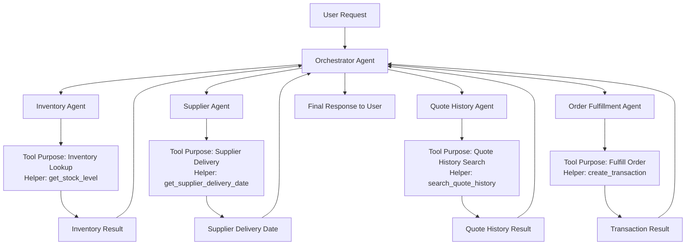

```mermaid
flowchart TD
    U["User Request"] --> O["Orchestrator Agent"]
 
    O --> IA["Inventory Agent"]
    O --> SA["Supplier Agent"]
    O --> QA["Quote History Agent"]
    O --> OA["Order Fulfillment Agent"]
 
    IA --> IT["Tool Purpose: Inventory Lookup<br/>Helper: get_stock_level"]
    SA --> ST["Tool Purpose: Supplier Delivery<br/>Helper: get_supplier_delivery_date"]
    QA --> QT["Tool Purpose: Quote History Search<br/>Helper: search_quote_history"]
    OA --> OT["Tool Purpose: Fulfill Order<br/>Helper: create_transaction"]
 
    IT --> IR["Inventory Result"]
    ST --> SR["Supplier Delivery Date"]
    QT --> QR["Quote History Result"]
    OT --> OR["Transaction Result"]
 
    IR --> O
    SR --> O
    QR --> O
    OR --> O
 
    O --> R["Final Response to User"]
```