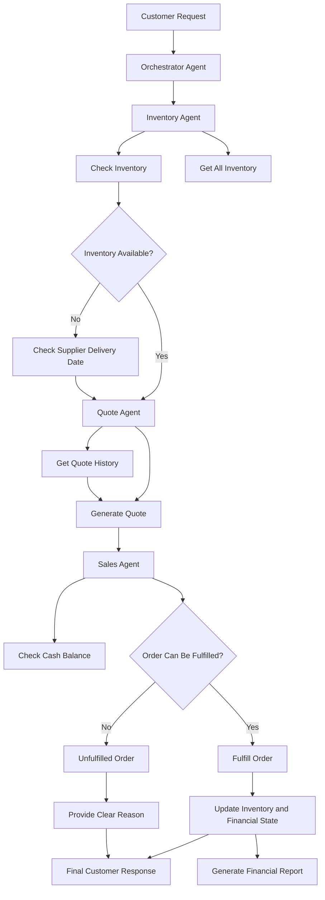

# Multi-Agent Paper Supply System – Agent Workflow
 

```mermaid
flowchart TD
    A[Customer Request] --> B[Orchestrator Agent]
 
    B --> C[Inventory Agent]
    C --> C1[Check Inventory]
    C --> C2[Get All Inventory]
    C1 --> D{Inventory Available?}
 
    D -->|Yes| E[Quote Agent]
    D -->|No| F[Check Supplier Delivery Date]
    F --> E
 
    E --> E1[Get Quote History]
    E --> E2[Generate Quote]
    E1 --> E2
 
    E2 --> G[Sales Agent]
 
    G --> G1[Check Cash Balance]
    G --> H{Order Can Be Fulfilled?}
 
    H -->|Yes| I[Fulfill Order]
    I --> J[Update Inventory and Financial State]
 
    H -->|No| K[Unfulfilled Order]
    K --> K1[Provide Clear Reason]
 
    J --> L[Final Customer Response]
    K1 --> L
 
    J --> M[Generate Financial Report]
```